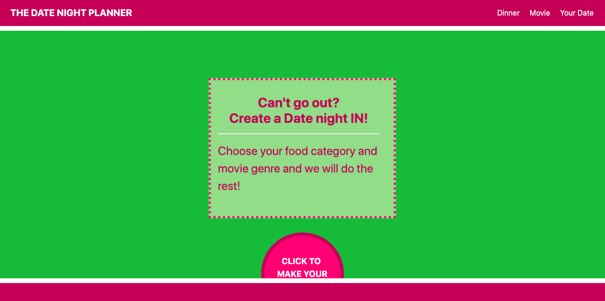
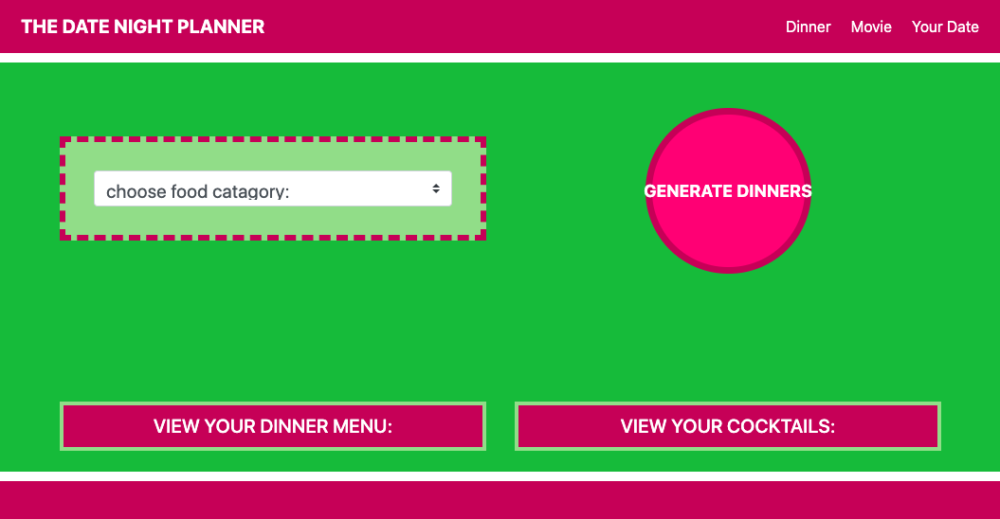
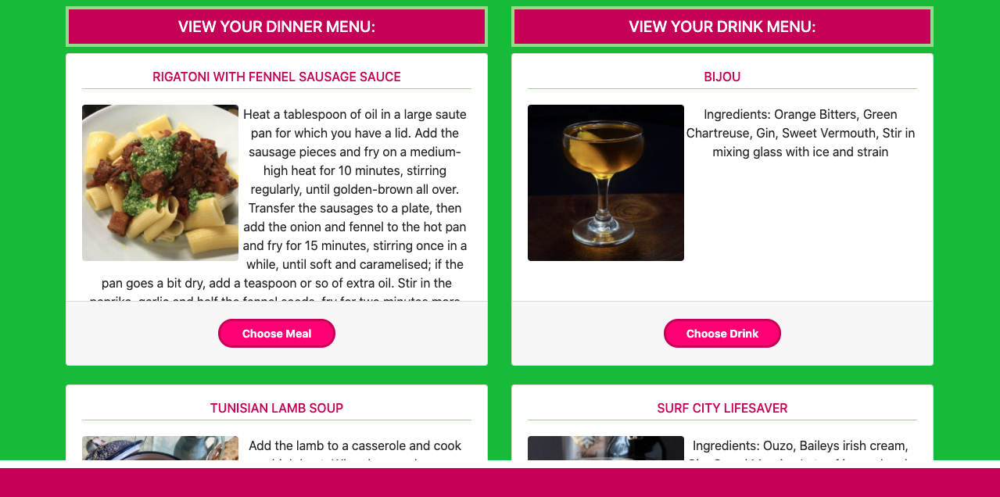
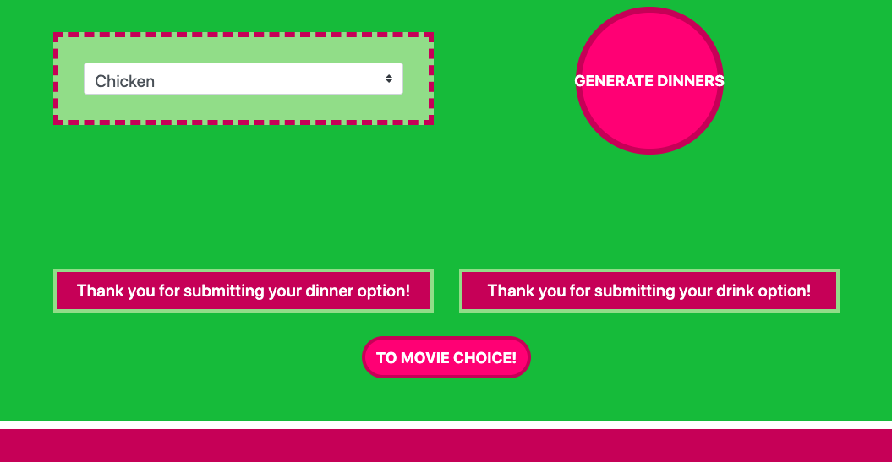
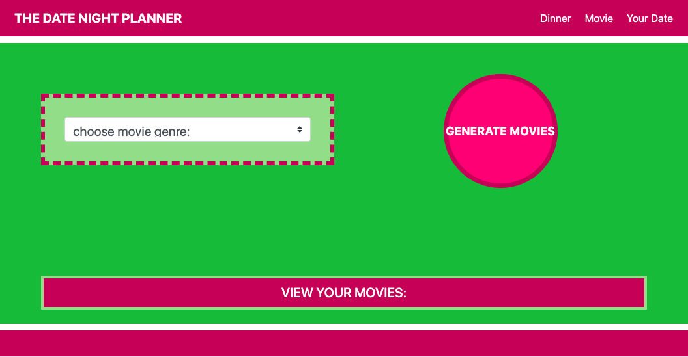
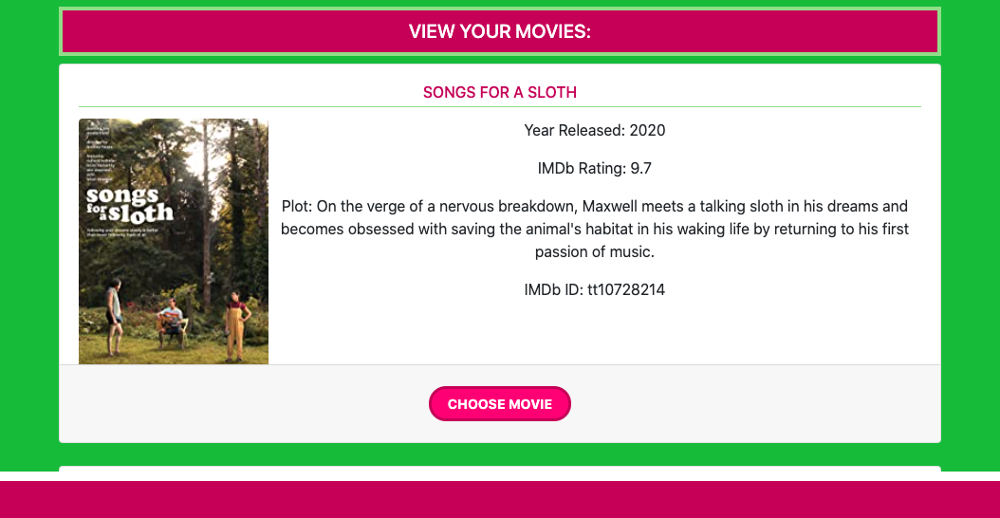
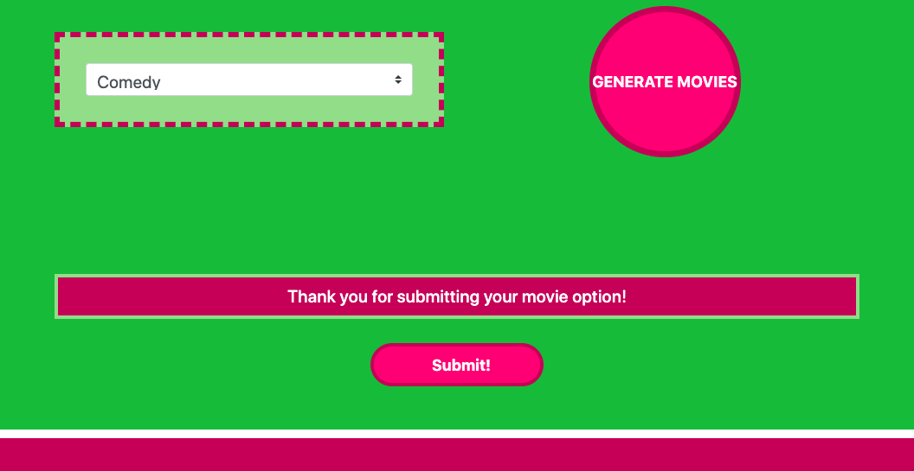
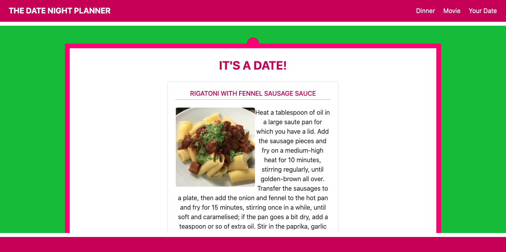

# The-Date-Night-Planner

## Description 

The Date Night Planner is a web application created to assist individuals who can’t go out for a date night and are running out of ideas for date nights at home. This application reduces the pressure of finding new food, cocktails, and movie ideas.

We began with a wireframe to outline the desired appearance our web application:

[The Date Night Planner_01.pdf](https://github.com/erinleecrocker/Erin-my-responsive-portfolio/files/5248802/The.Date.Night.Planner_01.pdf)

## Table of Contents 

* [Installation](#installation)
* [Usage](#usage)
* [Credits](#credits)
* [License](#license)

## Installation

To view the deployed site visit:
https://cgriffin332.github.io/The-Date-Night-Planner/

## Usage 

This application starts with the Date Night planner home page, where the user is instructed to click the "Start your date" button. 

The user is taken to a page where they are able to choose the food base for their type of meal (chicken, seafood, vegitarian, etc.). 

After they lock in their decision by clicking the  "gennerate dinner" button their randomly generated recipie cards appear as well as suggested cocktail pairings. This is achieved through ajax queries to the TheMealDB api, and TheCocktailDB api, from where our suggestions originate and they are dynamically populated under their appropriate headings on the page. The user is then given a "choose meal" and "choose drink" option that adds the respective choice to local storage to be displayed on the final page. 

Once choices are made, the user is shown "Thank you for submitting your option." and can click the "to movie choice", which will migrate them to the movie page.

 On the movie page the user is allowed to choose the genre of movie they would like to watch.

 After clicking the "generate movie" button, by using the OTT Details api and our code, random movies with a 8.5 imdb rating or above are randomly dynamically populated under the movie choices heading. 

The user again can select a movie and they are thanked for submitting their choice.

The user can then click the "see your date" button, and is brought to the final page. 

On the final page, under the heading "its a date" the user can view their selected date options that are dynamically populated from local storage. If they wish to choose again they can click the "new date" button and redo the process or choose meal, movie, or your date to change a specific aspect of their selection and return to the final page.

## Credits

Members of our team include Rayshawn Bray, Erin Crocker, Calvin Griffin, and Ashlyn Smith. Our team accomplished this using HTML, CSS, JavaScript and Jquery, as well as TheMealDB api, TheCocktailDB api, and OTT Details api.

## Contact
Rayshawn Bray  
Email: raybray219@yahoo.com  
LinkedIn: www.linkedin.com/in/rayshawnbray  
Portfolio: https://2coldray.github.io/portfolio-update/

Erin Crocker  
Email: erinleecrocker@gmail.com  
LinkedIn: https://www.linkedin.com/mwlite/in/erinleecrocker  
Portfolio: https://erinleecrocker.github.io/Professional-Portfolio-Website/

Calvin Griffin  
Email: cgriffin332@gmail.com  
LinkedIn: https://www.linkedin.com/in/calvin-griffin-8247521b7/  
Portfolio: https://cgriffin332.github.io/Updated-Portfolio332/

Ashlyn Smith  
Email: ashlyn.marie.smith2@gmail.com  
LinkedIn: https://www.linkedin.com/in/ashlynmsmith2/  
Portfolio: https://ashlynmarie22.github.io/Ashlyn_Smith-s_Portfolio/

## License

MIT License

Copyright (c) [2020] [Calvin Griffin]

Permission is hereby granted, free of charge, to any person obtaining a copy
of this software and associated documentation files (the "Software"), to deal
in the Software without restriction, including without limitation the rights
to use, copy, modify, merge, publish, distribute, sublicense, and/or sell
copies of the Software, and to permit persons to whom the Software is
furnished to do so, subject to the following conditions:

The above copyright notice and this permission notice shall be included in all
copies or substantial portions of the Software.

THE SOFTWARE IS PROVIDED "AS IS", WITHOUT WARRANTY OF ANY KIND, EXPRESS OR
IMPLIED, INCLUDING BUT NOT LIMITED TO THE WARRANTIES OF MERCHANTABILITY,
FITNESS FOR A PARTICULAR PURPOSE AND NONINFRINGEMENT. IN NO EVENT SHALL THE
AUTHORS OR COPYRIGHT HOLDERS BE LIABLE FOR ANY CLAIM, DAMAGES OR OTHER
LIABILITY, WHETHER IN AN ACTION OF CONTRACT, TORT OR OTHERWISE, ARISING FROM,
OUT OF OR IN CONNECTION WITH THE SOFTWARE OR THE USE OR OTHER DEALINGS IN THE
SOFTWARE.

---

 

